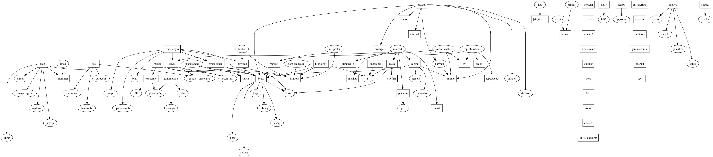
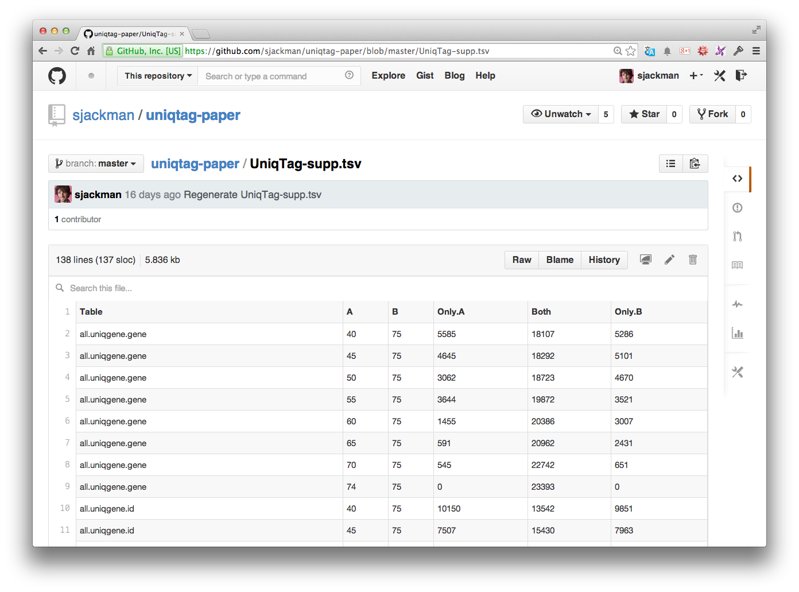

Open and reproducible science
================================================================================

+ Open science
+ Repeatable science
	- by you
	- by others
+ Reproducible science

Open science
================================================================================

+ Publish all research outputs
+ Self-archive manuscripts and pre-prints
+ Sign peer reviews
+ Even publish reviews, if the manuscript is public

Publish all research outputs
================================================================================

+ Data
+ Scripts
+ Manuscript
+ Publication

Repeatable science
================================================================================

+ Given the same data and scripts&hellip;
+ Reproduce the same results
+ At least by you, this should be the minimum bar
+ Hopefully repeatable by others as well

Reproducible science
================================================================================

+ Given the manuscript, someone else can
+ Repeat the experiment
+ Analyse the data
+ Come to the same conclusion

Repeatable vs. reproducible science
================================================================================

+ Reproducibility is fundamental to science
+ Often we don't even accomplish repeatable science
+ So let's start there

Managing software versions and dependencies
================================================================================

+ Use [Homebrew][] or [Linuxbrew][] and [Homebrew-science][] to install software
+ In the publication, to report all versions of all software used, only need to write&hellip;

> Homebrew was used to install the required software from Homebrew-science version 2014-08.

[Homebrew]: http://brew.sh
[Linuxbrew]: http://brew.sh/linuxbrew/
[Homebrew-science]: http://brew.sh/homebrew-science/

Homebrew is the solution to dependency hell
================================================================================

Publish data
================================================================================

> Best way to set back your competitors is to release your #data. That way they have to analyze their data & *your* data
&mdash; @[ctitusbrown][]
| [BOSC 2014 keynote][]
| [A History of Bioinformatics (in the Year 2039)][]

[ctitusbrown]: https://twitter.com/ctitusbrown
[BOSC 2014 keynote]: http://video.open-bio.org/video/1/a-history-of-bioinformatics-in-the-year-2039
[A History of Bioinformatics (in the Year 2039)]: http://www.slideshare.net/c.titus.brown/2014-bosckeynote

Version control
================================================================================

+ git/[GitHub][] for (almost) everything!
+ Maybe not big data
+ Experimental design data
+ Results and summary statistics
+ All data in tab-separated values (TSV) format, where possible
+ GitHub renders TSV pretty!

[GitHub]: https://github.com/

Make
================================================================================

+ Downloads the data
+ Runs the analyses
+ Generates the tabular results
+ Renders the figures
+ Renders the manuscript

Turn this
================================================================================

Into this
================================================================================

Make for the pipeline
================================================================================

RMarkdown for the analyses
================================================================================

Markdown for the manuscript
================================================================================
